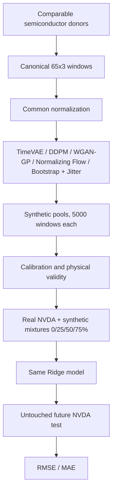
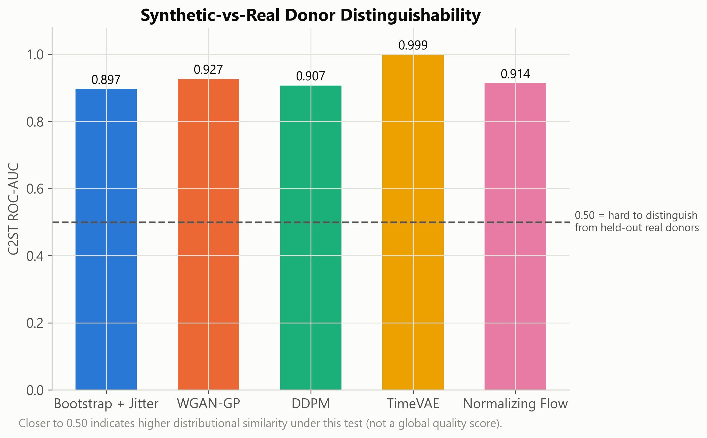
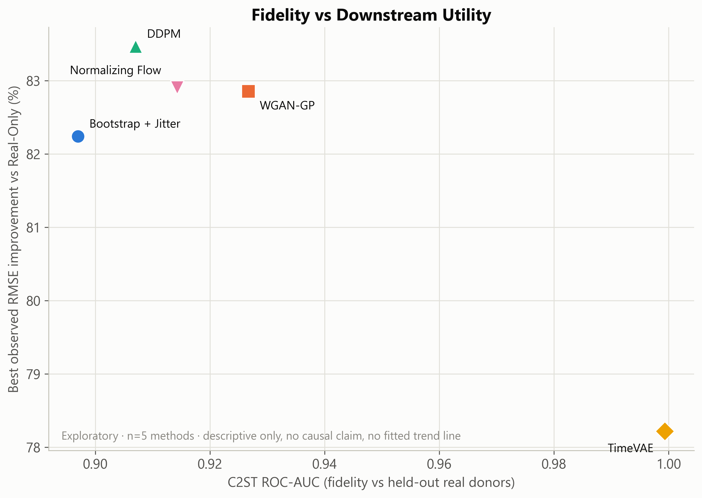

# Synthetic Data Augmentation for Financial Models with Limited Historical Data

> Can generative models improve volatility forecasting when target-asset
> history is scarce?

This repository implements and evaluates a common experimental pipeline
across four neural generative models and one simple baseline, all trained on
comparable donor assets and evaluated on their ability to improve a
downstream volatility-forecasting model for a target asset with a
deliberately short visible history. The experiment is frozen and certified under git tag
`strict-final-20260902`, and every quantitative claim below is traceable to
[`artifacts/final/strict_final_20260902/`](artifacts/final/strict_final_20260902/README.md).

## Table of Contents

- [Executive Summary](#executive-summary)
- [Financial Problem & Research Question](#financial-problem--research-question)
- [Experimental Design](#experimental-design)
- [End-to-End Pipeline](#end-to-end-pipeline)
- [Canonical Dataset](#canonical-dataset)
- [Generative Models](#generative-models)
- [Synthetic Fidelity Evaluation](#synthetic-fidelity-evaluation)
- [Downstream Utility Experiment](#downstream-utility-experiment)
- [Results](#results)
- [Key Findings](#key-findings)
- [Limitations](#limitations)
- [Reproducibility](#reproducibility)
- [Repository Structure](#repository-structure)
- [Generator Documentation](#generator-documentation)
- [Assignment Coverage](#assignment-coverage)

## Executive Summary

- **Target:** NVIDIA (NVDA), with only ~6 months of visible real history available to the downstream task.
- **Donors:** ten comparable semiconductor companies, used to train every generator.
- **Neural generators:** TimeVAE, DDPM, WGAN-GP, Normalizing Flow.
- **Simple baseline:** Bootstrap + Gaussian Jitter.
- **Synthetic augmentation:** 0% (`REAL_ONLY`), 25%, 50%, 75% synthetic share.
- **Downstream model:** the same Ridge regression, features, and scaler for every method and every share.
- **Target variable:** future 5-session annualized realized volatility.
- **Test set:** untouched future NVDA windows, 2023-2025.
- **Main result:** synthetic augmentation substantially outperformed the deliberately data-scarce `REAL_ONLY` setup, across every generator and every tested share.

## Financial Problem & Research Question

> "If only six months of real NVIDIA history were available, can generative
> models trained on comparable semiconductor companies produce synthetic
> NVIDIA-like financial observations that improve a model predicting future
> volatility?"

This is **not** an attempt to literally reconstruct NVDA's missing history.
The problem under study is **data augmentation under target-history
scarcity**: a newly listed or thinly traded asset may have too few
observations to train a reliable downstream model, while comparable, more
mature assets in the same sector have abundant history. The experiment tests
whether that donor-sector information, transferred through a generative
model and expressed as synthetic observations, produces a larger and more
useful downstream training set than the scarce real data alone.

The logic chain evaluated end to end is:

```
limited visible NVDA history
    +
information learned from comparable semiconductor stocks
    +
synthetic observations
    →
larger downstream training set
    →
improved future volatility forecasting
```

## Experimental Design

- **Target:** NVDA.
- **Donors:** AMD, INTC, QCOM, AVGO, MU, TXN, ADI, MCHP, MRVL, NXPI.
- **Raw history:** 2012-01-03 to 2025-12-31.
- **Channels (fixed order):** `log_return`, `log_high_low_range`, `log1p_volume`.
- **Window:** 65 sessions x 3 channels.

| Split | Date range | Role |
|---|---|---|
| `donor_train` | 2012-01-03 to 2021-12-31 | generator training; common normalization fit |
| `donor_validation` | 2022-01-03 to 2022-12-30 | held-out common fidelity reference |
| `nvda_visible` | 2022-07-01 to 2022-12-30 | downstream `REAL_ONLY` training; NVDA calibration |
| `nvda_full_history` | 2012-01-03 to 2022-12-30 | full-history benchmark only; not an input to phases 01/02/03 |
| `nvda_test` | 2023-01-03 to 2025-12-31 | untouched future evaluation |

The future NVDA test window never enters generator training, generator
selection, calibration, or downstream fitting. The held-out `donor_validation`
split is the single common fidelity reference for every generator. Common
normalization statistics are fitted exclusively on `donor_train` and then
applied, unchanged, everywhere else.

## End-to-End Pipeline



Three common phases enforce this chain in code:
[`01_contract`](common_pipeline/01_contract/README.md) certifies each
generator's output and official role; [`02_fidelity`](common_pipeline/02_fidelity/README.md)
compares synthetic windows against held-out real donors; [`03_utility`](common_pipeline/03_utility/README.md)
measures downstream impact on NVDA forecasting. See
[`common_pipeline/README.md`](common_pipeline/README.md) for the phase-level
index.

## Canonical Dataset

| Dataset | Purpose | Windows |
|---|---|---:|
| `donor_train` | generator training + common normalization | 4,910 |
| `donor_validation` | common fidelity reference | 380 |
| `nvda_visible` | downstream `REAL_ONLY` training | 62 |
| `nvda_full_history` | full-history benchmark (not used in 01/02/03) | 2,703 |
| `nvda_test` | untouched future evaluation | 150 |

`donor_train` SHA256: `5f1e33f69b02bad86d89dcc2f67a1018cef68aaeacfbf72c310a1b7902fc268f`.

Full snapshot boundary, all five SHA256 values, and provenance are documented
in [`data/CANONICAL_EXPERIMENT_DATA.md`](data/CANONICAL_EXPERIMENT_DATA.md).

## Generative Models

| Method | Family | Core mechanism | Documentation |
|---|---|---|---|
| TimeVAE | Variational autoencoder | Probabilistic temporal latent representation | [Full documentation](generadores/marco/README.md) |
| DDPM | Diffusion | Iterative noise prediction and reverse denoising | [Full documentation](generadores/daniel/README.md) |
| WGAN-GP | Adversarial | Generator/critic optimized with a Wasserstein objective and gradient penalty | [Full documentation](generadores/cristian/README.md) |
| Normalizing Flow | Invertible density model | Technical description pending final individual documentation | Pending |
| Bootstrap + Jitter | Simple baseline | Whole-window bootstrap + Gaussian perturbation | [Baseline details](#bootstrap--jitter) |

Each summary below covers only family, core idea, and official output; full
architecture, training curves, and per-generator diagnostics live in the
linked individual README.

### TimeVAE

TimeVAE learns a probabilistic temporal latent representation of donor
windows: a Conv1D encoder produces the mean and log-variance of an 8-dimensional
latent code, and a Conv1D-transpose decoder reconstructs the 65x3 window from
a sample of that code. Training combines a Huber reconstruction loss with a
KL term using free-bits regularization and a KL warmup schedule. At
generation time, windows are sampled directly from the latent prior
(`z ~ N(0, I)`) and decoded, producing 5,000 synthetic windows that are
exported both in the common normalized space and recalibrated to NVDA scale.

[Full TimeVAE documentation](generadores/marco/README.md)

### DDPM

The DDPM is an epsilon-prediction denoising diffusion model: a forward
process adds Gaussian noise to a normalized donor window over a fixed
schedule, and a temporal Conv1D residual network with sinusoidal timestep
embedding learns to predict that noise so it can be removed step by step at
generation time. Training uses `T = 100` diffusion timesteps and a linear
beta schedule. The official output is 5,000 synthetic windows sampled from
the checkpoint selected by minimum `donor_validation` loss, with training
evidence tracked across 3 independent training seeds.

[Full DDPM documentation](generadores/daniel/README.md)

### WGAN-GP

WGAN-GP is an adversarial model: an MLP generator maps latent noise
(`latent_dim = 100`) to a 65x3 window, and a Conv1D critic scores real versus
generated windows without a sigmoid activation. Training optimizes a
Wasserstein objective with a gradient-penalty term (`lambda_gp = 10`) and a
5:1 critic-to-generator update ratio, using Adam with `beta1 = 0`. The
official run produces 5,000 synthetic windows per seed in the common
normalized space, validated by the phase-01 contract.

[Full WGAN-GP documentation](generadores/cristian/README.md)

### Normalizing Flow

<!-- DAVID_FINAL_README_INTEGRATION_START -->

> **Pending final individual documentation**
>
> Normalizing Flow is already included in the frozen common evaluation and
> therefore its STRICT_FINAL comparative results are reported below.
> Generator-specific architecture, training details and diagnostics will be
> integrated from `generadores/david/README.md` once the final individual
> documentation is delivered.

<!-- DAVID_FINAL_README_INTEGRATION_END -->

### Bootstrap + Jitter

The common simple baseline resamples whole windows from the canonical
`donor_train` set (seed 42) and adds independent Gaussian jitter
(`sigma = 0.05`) to every value, producing 5,000 synthetic windows in the
same normalized representation used by every neural generator. It contains
no learned parameters. Its purpose is methodological: it lets the experiment
check whether the added complexity of a neural generator produces any
downstream benefit beyond what an extremely simple augmentation strategy
already provides.

## Synthetic Fidelity Evaluation

Fidelity is assessed against the held-out `donor_validation` split — **380
real donor windows, not NVDA** — compared with a fixed, equal-size subset of
each method's synthetic pool. The common fidelity pipeline reports, per
method, without ever combining them into a composite score:

- marginal statistics and Wasserstein-1 distance, per channel;
- return and absolute-return autocorrelation (ACF), lags 1-20;
- channel correlation structure;
- nearest-neighbour distance diagnostics;
- a classifier two-sample test (C2ST): logistic regression, 5-fold
  out-of-fold ROC-AUC;
- a joint PCA/t-SNE embedding, as a qualitative diagnostic only.

C2ST is the headline distinguishability metric: an AUC near 0.5 means the
classifier cannot reliably tell real and synthetic windows apart under this
test, while an AUC approaching 1.0 means systematic differences remain
detectable. It is one diagnostic among several, not a global quality score.



*C2ST ROC-AUC per method against held-out real donors. 0.50 marks the
"indistinguishable" reference; no method reaches it, and no single method
leads on every fidelity metric (see [Results](#does-better-fidelity-mean-better-utility)).*

## Downstream Utility Experiment

- **Real visible training set:** 62 NVDA windows (`nvda_visible`).
- **Synthetic shares:** 0% / 25% / 50% / 75%, corresponding to 0 / 21 / 62 / 186 synthetic windows added to the 62 real ones.
- **Downstream mixture/subsampling seeds:** 42, 123, 2026 — these resample which synthetic windows enter the mixture; they are independent of any generator's own training seed.
- **Features (8, per window):** `rv5`, `rv20`, `rv60`, `mean_abs_return20`, `momentum20`, `mean_range20`, `mean_log_volume20`, `std_log_volume20`.
- **Target:** future 5-session annualized realized volatility.
- **Scaler:** one `StandardScaler`, fitted once on the 62 real NVDA windows and reused unchanged for every mixture.
- **Model:** `Ridge(alpha=1)`, no hyperparameter tuning.
- **Test set:** 150 untouched future NVDA windows, 2023-2025.
- **Metrics:** RMSE, MAE.

Using the identical downstream model, feature set, scaler, and test set for
every generator and every share isolates the effect of **which generator**
and **how much synthetic data**, rather than confounding the comparison with
downstream model selection.

## Results

All figures and numbers in this section are read directly from
[`reports/final_analysis/`](reports/final_analysis/ANALYSIS.md), which is
itself derived exclusively from the frozen
[`artifacts/final/strict_final_20260902/`](artifacts/final/strict_final_20260902/)
snapshot. Model names are used throughout; internal identifiers are
implementation detail.

### REAL_ONLY Benchmark

Training the downstream Ridge model on the 62 real NVDA windows alone, with
no synthetic augmentation, gives:

- **RMSE = 1.479584**
- **MAE = 1.146934**

This is the single common reference against which every augmented
configuration below is compared. With so few real training windows the
downstream model generalizes poorly to the future test set; this large error
is the expected consequence of the deliberately scarce training scenario,
not a defect in the pipeline.

### Effect of Synthetic Share


*RMSE improvement (%) relative to `REAL_ONLY`, five methods x three synthetic
shares. Positive values indicate lower forecasting error.*

Adding synthetic data strongly improves on the data-scarce `REAL_ONLY`
benchmark for every method at every tested share (all cells above are
positive, 74-84%). Mean RMSE is lowest at 75% for all five methods, though
the gain from 25% to 50% is small, or within the seed-to-seed variability
observed for that method (DDPM in particular is essentially flat between
25% and 50% before dropping sharply at 75% — see
[Stability Across Downstream Seeds](#stability-across-downstream-seeds)).
The generators are not interchangeable across shares: their relative
ordering shifts as the synthetic share increases.

### Performance at 75% Synthetic

At the 75% synthetic share — where every method reaches its best observed
RMSE and MAE — the ranking by RMSE is:

| Method | RMSE mean | RMSE SD | RMSE improvement vs `REAL_ONLY` | MAE mean |
|---|---:|---:|---:|---:|
| DDPM | **0.244600** | 0.007319 | 83.47% | 0.179606 |
| Normalizing Flow | 0.252899 | 0.005743 | 82.91% | **0.174023** |
| WGAN-GP | 0.253658 | 0.015764 | 82.86% | 0.182242 |
| Bootstrap + Jitter | 0.262744 | 0.004975 | 82.24% | 0.184047 |
| TimeVAE | 0.322274 | 0.003157 | 78.22% | 0.233442 |

*Lowest RMSE: DDPM. Lowest MAE: Normalizing Flow.*


DDPM has the lowest observed RMSE and Normalizing Flow the lowest observed
MAE; WGAN-GP remains very close to both. Bootstrap + Jitter — the
zero-parameter baseline — is highly competitive, ranking ahead of one neural
generator. TimeVAE still improves substantially on `REAL_ONLY` (+78.22%
RMSE) but provides the lowest downstream utility of the five methods in this
particular setup.

### Neural Models vs Simple Baseline


*Positive = the neural method improved more than Bootstrap + Jitter over
`REAL_ONLY`, in percentage points of RMSE improvement. Negative = the simple
baseline did better.*

| Method | @25% (pp) | @50% (pp) | @75% (pp) |
|---|---:|---:|---:|
| WGAN-GP | +0.14 | +0.62 | +0.61 |
| Normalizing Flow | +0.10 | +0.81 | +0.67 |
| DDPM | -1.64 | -1.71 | +1.23 |
| TimeVAE | -6.49 | -4.86 | -4.02 |

Neural complexity does not guarantee a uniform improvement over the simple
augmentation baseline. WGAN-GP and Normalizing Flow beat Bootstrap + Jitter
at every tested share; DDPM only overtakes it once the share reaches 75%;
TimeVAE does not surpass it at any tested share. The baseline does not win
globally either — it is beaten by three of the four neural generators at
75%.

### Does Better Fidelity Mean Better Utility?



*Exploratory · n = 5 methods · descriptive only, no causal claim, no fitted
trend line.*

With only five methods, any relationship observed here is exploratory. Several
return-channel fidelity metrics (Wasserstein distance on `log_return`,
return/absolute-return ACF error, C2ST AUC) move together with utility
improvement in this sample, but the pattern is driven largely by TimeVAE
sitting at an extreme on both axes; other fidelity metrics, such as
nearest-neighbour distance, show no consistent relationship at all. A
generator may provide strong downstream utility even when a classifier can
still distinguish its synthetic samples from held-out real data — Bootstrap
+ Jitter has the best C2ST score of the five but only middling utility,
while DDPM has mediocre fidelity on several metrics yet the best observed
RMSE. **Distributional fidelity and downstream utility are related
concepts, but they are not interchangeable objectives.**

### Stability Across Downstream Seeds

The values `42`, `123`, `2026` used throughout this section are **downstream
mixture/subsampling seeds** — they control which synthetic windows are drawn
into each mixture — not generator-training seeds.

| Method | RMSE SD @75% |
|---|---:|
| TimeVAE | 0.003157 |
| Bootstrap + Jitter | 0.004975 |
| Normalizing Flow | 0.005743 |
| DDPM | 0.007319 |
| WGAN-GP | 0.015764 |


TimeVAE is the most seed-stable method at every share it was evaluated at,
despite being the least accurate one — stability and accuracy are separate
axes in this experiment. DDPM is the least stable configuration observed, at
its own 50% share (RMSE SD = 0.063834), yet becomes one of the most stable
and most accurate methods at 75%. With only three seeds these are
descriptive spreads, not confidence intervals.

## Key Findings

1. Synthetic augmentation substantially improves forecasting relative to the deliberately data-scarce `REAL_ONLY` setup, across every generator and every tested share.
2. Synthetic share materially changes downstream performance; the strongest configurations in this experiment generally occur at 75%.
3. DDPM achieves the lowest observed RMSE: ~0.2446 at 75%.
4. Normalizing Flow achieves the lowest observed MAE: ~0.1740 at 75%.
5. Bootstrap + Jitter remains highly competitive, while the fidelity analysis shows that greater generative sophistication or stronger distributional similarity does not automatically imply greater downstream utility.

## Limitations

- One target asset (NVDA) and one sector-specific donor universe (semiconductors).
- One downstream architecture (Ridge) and one target variable (5-session annualized realized volatility).
- Only three downstream mixture/subsampling seeds per method and share.
- A discrete augmentation grid (25% / 50% / 75%); intermediate shares were not evaluated.
- A deliberately extreme six-month target-history scarcity scenario, chosen to stress-test augmentation rather than to model a typical deployment.
- Model comparisons ("best RMSE", "most stable") are post-hoc observational descriptions, not the result of model selection or tuning against the test set.
- The fidelity-vs-utility association is exploratory, computed over five methods, and does not support causal interpretation.

## Reproducibility

The full environment, command reference, and the distinction between local
runtime outputs and the tracked final snapshot are documented in
[`docs/REPRODUCIBILITY.md`](docs/REPRODUCIBILITY.md). At a high level:

1. **Environment** — install root requirements, then each generator's own requirements as needed (see `docs/REPRODUCIBILITY.md`).
2. **Config validation** — `configs/experiment.yaml` is the frozen source of split, feature, and path configuration for the data pipeline.
3. **Canonical data** — the five canonical Parquets are tracked and present in a clean clone; see [`data/CANONICAL_EXPERIMENT_DATA.md`](data/CANONICAL_EXPERIMENT_DATA.md).
4. **Generator-output validation** — `python common_pipeline/01_contract/validate_outputs.py`.
5. **Fidelity** — `python common_pipeline/02_fidelity/evaluate_fidelity.py` then `python common_pipeline/02_fidelity/plot_fidelity.py`.
6. **Downstream utility** — `python -m common_pipeline.03_utility.calibrate_nvda`, `validate_physical`, `build_mixtures`, `downstream_ridge`, `plot_utility`, `interpretation_summary` (each as `python -m common_pipeline.03_utility.<step>`).
7. **Reporting / final figures** — `python reports/build_final_analysis.py` then `python reports/build_final_figures.py`, both reading exclusively from the frozen snapshot below.

```bash
python -m pytest -q
```

- **Scientific tag:** `strict-final-20260902`.
- **Authoritative snapshot:** [`artifacts/final/strict_final_20260902/`](artifacts/final/strict_final_20260902/README.md).

## Repository Structure

```text
data/            canonical Parquets, manifests, checksums (data/CANONICAL_EXPERIMENT_DATA.md)
configs/         frozen experiment configuration (configs/experiment.yaml)
scripts/         data-pipeline entrypoints (download, clean, split, features)
common_pipeline/ shared contract, fidelity, and utility phases (01/02/03)
generadores/     one subfolder per generator (marco, daniel, cristian, david)
artifacts/       frozen STRICT_FINAL snapshot and historical provisional evidence
reports/         derived analysis tables, ANALYSIS.md, and final report figures
docs/            reproducibility guide and historical certification records
tests/           common-core anti-leakage and boundary tests
notebooks/       exploratory data analysis, not part of the certified pipeline
```

## Generator Documentation

| Generator | Documentation | Status | Owner |
|---|---|---|---|
| TimeVAE | [`generadores/marco/README.md`](generadores/marco/README.md) | Final | Marco |
| DDPM | [`generadores/daniel/README.md`](generadores/daniel/README.md) | Final | Daniel |
| WGAN-GP | [`generadores/cristian/README.md`](generadores/cristian/README.md) | Final | Cristian |
| Normalizing Flow | [`generadores/david/README.md`](generadores/david/README.md) | Pending final individual integration | David |
| Bootstrap + Jitter | [Baseline details](#bootstrap--jitter), [`common_pipeline/01_contract/README.md`](common_pipeline/01_contract/README.md) | Final | Common pipeline |

## Assignment Coverage

| Requirement | Implementation |
|---|---|
| Financial problem definition | NVDA future-volatility forecasting under scarce target history |
| 3+ neural generative models | TimeVAE, DDPM, WGAN-GP, Normalizing Flow |
| Additional simple method | Bootstrap + Jitter |
| Synthetic-data proportions | 25%, 50%, 75% (plus the 0% `REAL_ONLY` reference) |
| Same downstream architecture for all comparisons | `Ridge(alpha=1)`, identical features and scaler |
| Model training | Each generator trained on canonical `donor_train`; see individual READMEs |
| Convergence/loss evidence | Generator-specific training evidence (see [Generator Documentation](#generator-documentation)) |
| Synthetic fidelity evaluation | Common fidelity pipeline (`02_fidelity`) vs held-out real donors |
| Downstream utility evaluation | Common utility pipeline (`03_utility`) vs untouched future NVDA |
| Comparison across methods, including the simple baseline | [Results](#results) |
| Reproducible code | Common pipeline, generator scripts, and tests (see [Reproducibility](#reproducibility)) |
| Reported figures and tables | [`reports/final_analysis/`](reports/final_analysis/ANALYSIS.md) and this document |
