# Generador A — WGAN-GP (Cristian)

WGAN-GP adaptado al problema de cold-start de NVDA: aprende de 10
semiconductores donors (2012-2021) y genera ventanas sintéticas `[65, 3]`
en el espacio normalizado de `donor_train`, para complementar los 6 meses
reales visibles de NVDA.

## Arquitectura

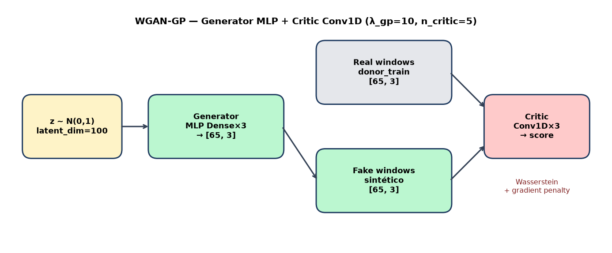

Generator: MLP `Dense(256) → Dense(512) → Dense(65×3)` → `Reshape([65, 3])`,
activado con LeakyReLU + BatchNorm. Critic: 3×Conv1D (64/128/256) → Flatten →
Dense(128) → score escalar (sin sigmoid). `latent_dim=100`, `n_critic=5`,
`λ_gp=10`. Sin condicionante — el generador no ve ticker ni régimen; solo
aprende la distribución conjunta de donors.

## Datos

| Split                        | Ventanas | Uso                                                     |
| ---------------------------- | -------- | ------------------------------------------------------- |
| `donor_train`                | 4910     | entrenamiento WGAN-GP                                   |
| `donor_validation`           | 380      | evaluación generativa (no se usa para early stopping)   |
| `nvda_visible`               | 62       | NVDA "cold-start" (jul-dic 2022) — **prohibido tunear** |
| `nvda_hidden` / full history | ~2576    | referencia de dominio distinto (diagnóstico)            |
| `nvda_test`                  | 150      | hold-out real, tarea downstream                         |

NVDA nunca entra en el entrenamiento. El scaler (media/std por canal) se ajusta
solo sobre `donor_train`.

## Entrenamiento

Adam lr=1e-4, `β1=0`, `β2=0.9`, batch 64, Wasserstein + gradient penalty.
Run oficial (seed 42): **300 épocas** (índices 0..299) — no las 5000 del
`configs/wgan_gp.yaml` (valor histórico/default). Evidencia en
`evidence/` (`loss_history.csv`, `training_manifest.json`).

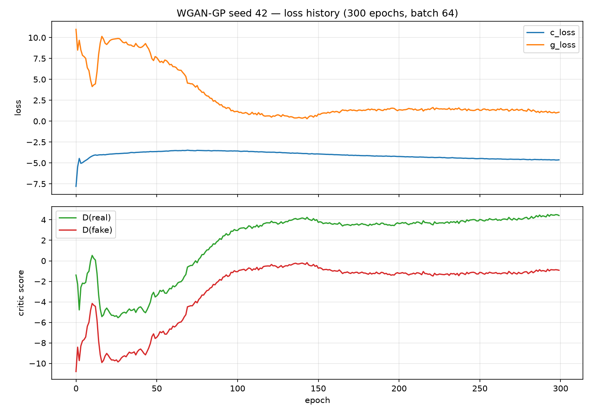

Tras el entrenamiento, las trayectorias sintéticas de `log_return` ya
reproducen la escala y el “ruido” de las reales:

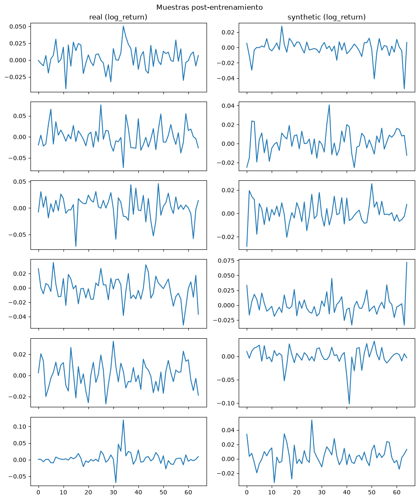

## Generación

Se genera muestreando `z~N(0,1)` y pasando por el generator — 5000 ventanas
por seed (`42`, `123`, `2026`). Export en dos espacios:

- `outputs/synthetic_seed{SEED}_n5000_normalized.parquet` — z-score
`donor_train` (**sin calibrar a NVDA**; esquema común de comparación)
- `outputs/synthetic_seed{SEED}_n5000.parquet` — desnormalizado a escala
original de canales

Validado por el contrato común (`common_pipeline/01_contract`).

## Métricas de calidad

Tres comparaciones, separando “¿aprendió bien la distribución de
entrenamiento?” (contra donors) de “¿se parece a NVDA sin calibrar?”
(diagnóstico de dominio — no es el objetivo del generador puro):

### 1) Sintético vs. `donor_train` / `donor_validation` (agregado 3 seeds)

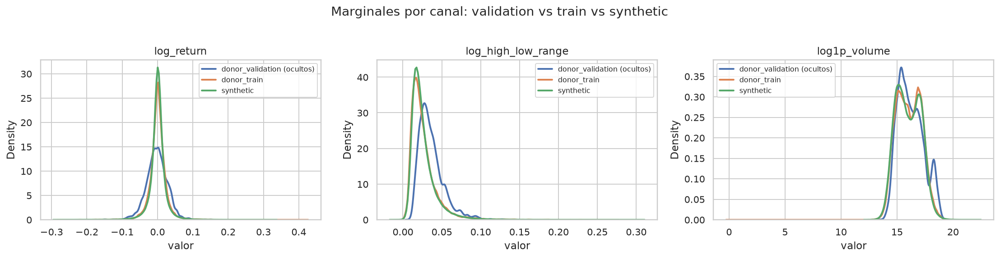
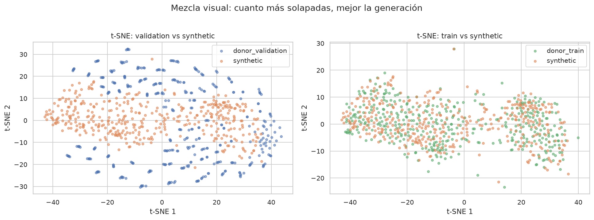
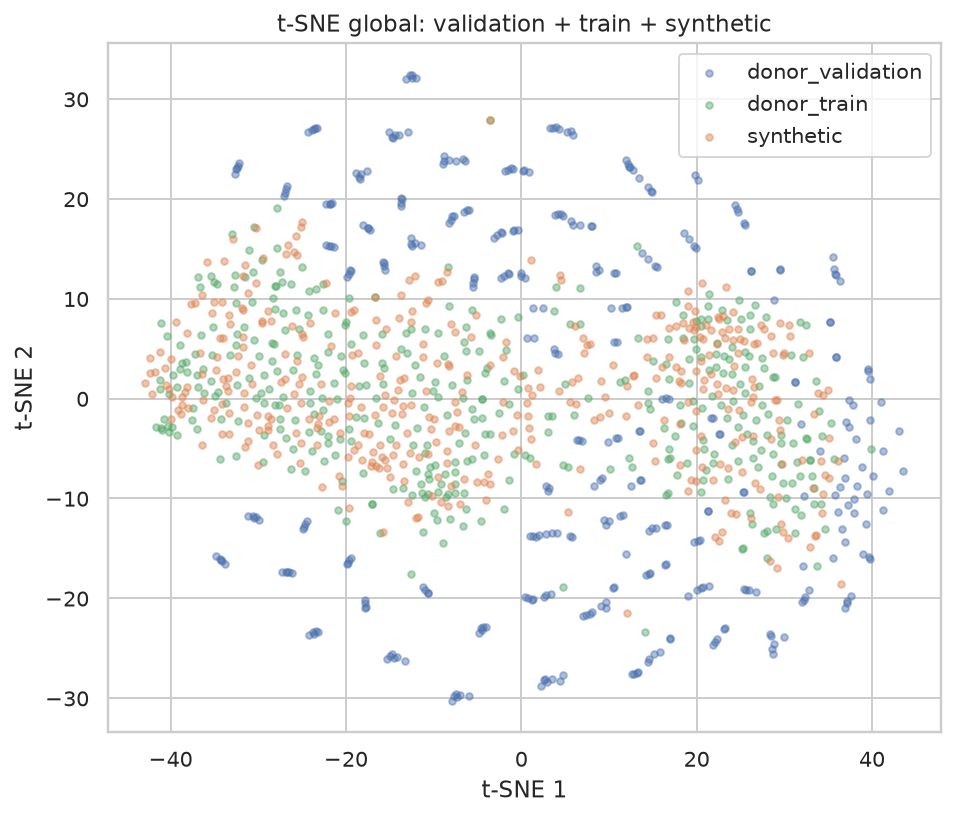
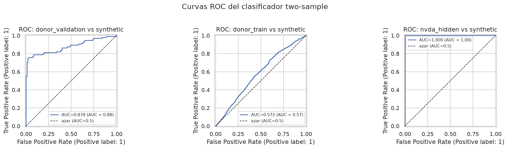

Marginales: media/std de los 3 canales del sintético casi coinciden con
`donor_train` (`log_return` 0.0009±0.022 vs 0.0008±0.024;
`log_high_low_range` y `log1p_volume` igual de cerca). Frente a
`donor_validation` (2022) hay un shift de régimen esperable — validation es
más volátil y con volumen distinto.

t-SNE: solapamiento fuerte con `donor_train`; `donor_validation` forma
nubes parcialmente separadas (año atípico), coherente con el clasificador.

### 2) Vista validation-only (notebook 03)

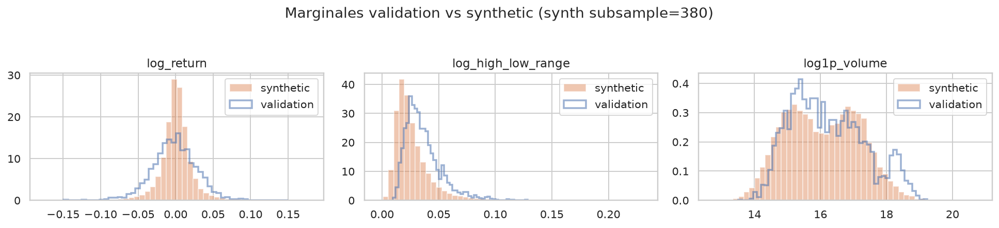
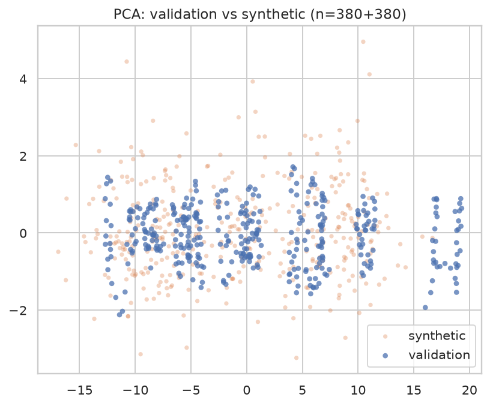
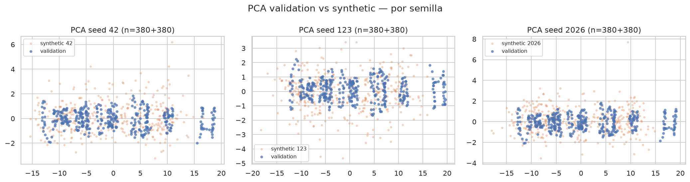

Las tres seeds se comportan de forma similar en PCA; ninguna es un outlier
claro. MMD flat por seed vs validation: 0.006 (42), 0.015 (123), 0.009 (2026).

### 3) Discriminative score (clasificador logístico / C2ST)

AUC del clasificador two-sample (CV estratificado) y score estilo
`|accuracy − 0.5|` para comparar con el resto de generadores:

| Referencia                   | AUC (CV) | Acc (CV) | Disc. `|acc−0.5|` |
| ---------------------------- | -------- | -------- | ----------------- |
| `donor_train`                | 0.562    | 0.548    | **0.048**         |
| `donor_validation`           | 0.906    | 0.838    | 0.338             |
| `nvda_hidden` (sin calibrar) | 1.000    | 1.000    | 0.500             |

El sintético es casi indistinguible de lo que entrenó (`donor_train`, disc.
≈ 0.05) y mucho más separable de `donor_validation` — mismo patrón que el
VAE de Marco: 2022 ya es un año atípico en donors, no un fallo del
generador. Contra `nvda_hidden` sin calibrar el clasificador acierta siempre
(AUC 1.0): distinto ticker/escala; la utilidad NVDA pasa por el pipeline
común de calibración (`common_pipeline/03_utility`).

### Autocorrelación temporal

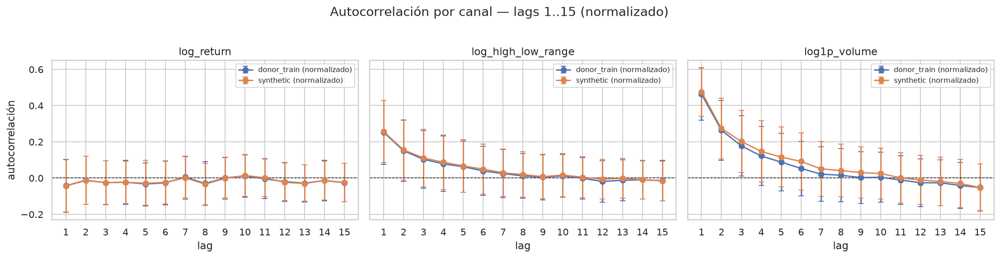

En espacio normalizado, el sintético reproduce muy bien la memoria de
`donor_train`:

| Canal                | ACF lag-1 real | ACF lag-1 sintético |
| -------------------- | -------------- | ------------------- |
| `log_return`         | −0.043         | −0.044              |
| `log_high_low_range` | 0.252          | 0.257               |
| `log1p_volume`       | 0.463          | 0.476               |

## Limitaciones

- **Run oficial ≠ yaml**: el output publicado sale de 300 épocas (seed 42),
no de las 5000 listadas en `configs/wgan_gp.yaml`. Ver `evidence/`.
- **Reproducibilidad bit-a-bit no garantizada**: generator/critic se
construyen en `WGAN_GP.__init__()` antes de `set_random_seed()` en
`train()` — un retrain no será idéntico byte a byte, pero no invalida
el output ya publicado.
- **Shift train/validation**: el clasificador separa bien validation
(AUC ~0.91). Coherente con 2022 como régimen distinto en donors; no
implica colapso del generador (contra train el disc. score es ~0.05).
- **Dominio NVDA sin calibrar**: AUC 1.0 vs `nvda_hidden` es esperado —
el generador no ve NVDA. La calibración/mezclas son fase común, no de
este README.
- **Valores físicos borderline**: el sintético desnormalizado puede producir
`log_high_low_range` ligeramente negativo (min ≈ −0.014); hay que
filtrarlo/recortarlo en el pipeline de utilidad si se exige rango ≥ 0.
- **Provenance de** `donor_train`: el parquet local del entrenamiento y el
canónico actual no son bytes-idénticos (diff float ~1e-6), pero
`SAME_SCIENTIFIC_DATA` / `RETRAIN_REQUIRED=NO` (ver `evidence/README.md`).

