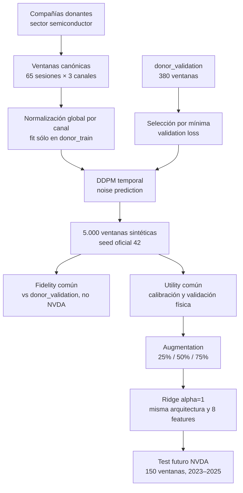
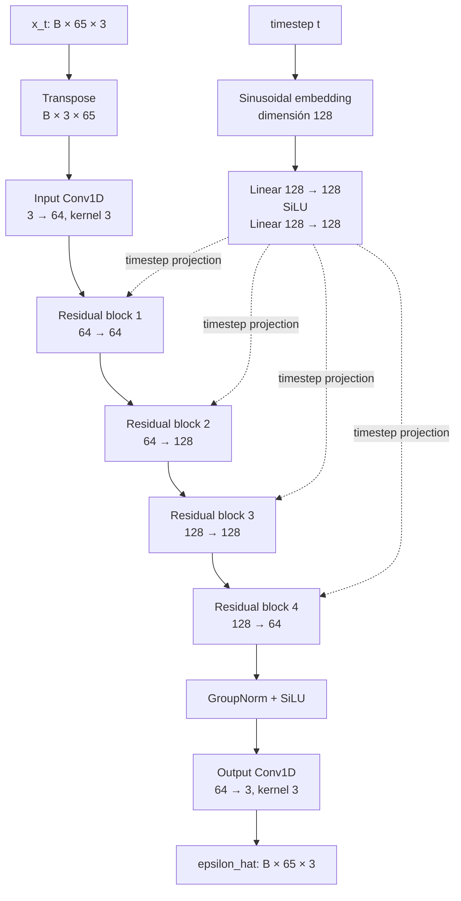
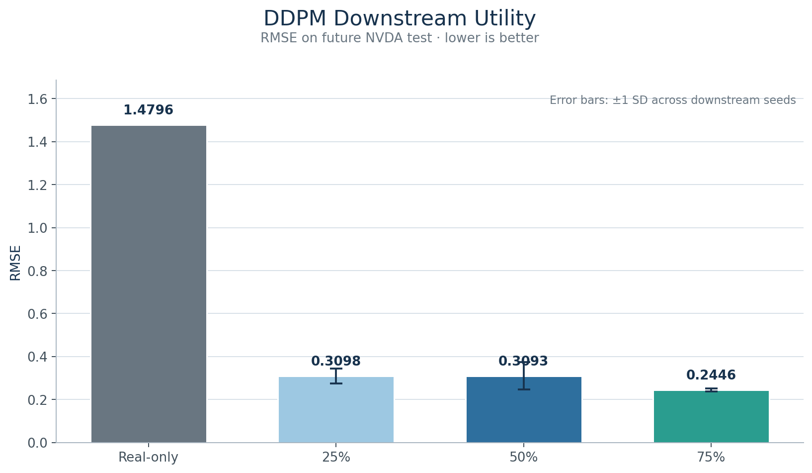
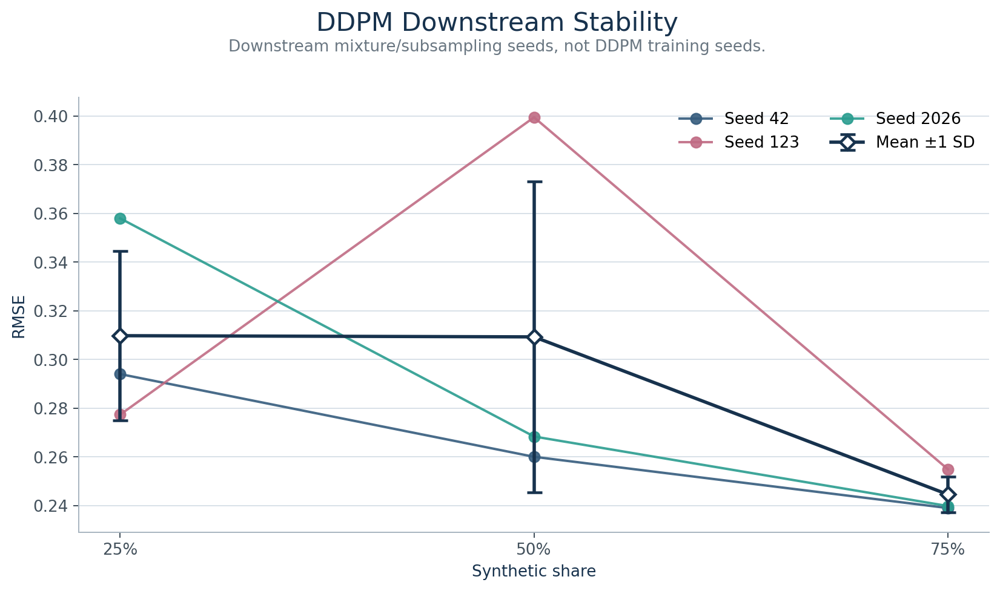

# DDPM — Denoising Diffusion Probabilistic Model

**Generación de ventanas financieras sintéticas mediante difusión temporal.**

El DDPM es uno de los cuatro generadores neuronales comparados en el proyecto. Su función es aprender la distribución de ventanas financieras de compañías donantes del sector semiconductor y producir escenarios sintéticos en el mismo espacio normalizado común.

El problema experimental es de escasez de datos: **si sólo dispusiéramos de seis meses de historia visible de NVDA, ¿puede el _synthetic data augmentation_ mejorar la predicción de volatilidad futura?** Las ventanas generadas por el DDPM se incorporan posteriormente al entrenamiento de un modelo downstream común, manteniendo fija su arquitectura y su test.

El DDPM se entrena exclusivamente con datos de empresas donantes. **NVDA no interviene en el entrenamiento, la validación ni la selección del checkpoint del generador.**

Responsable de implementación: Daniel.

## DDPM at a glance

| Elemento | Valor |
|---|---:|
| Ventanas donantes de entrenamiento | 4.910 |
| Shape por ventana | `65 × 3` |
| Parámetros entrenables | 336.259 |
| Diffusion timesteps | 100 |
| Pool sintético oficial | 5.000 ventanas |
| Mejor RMSE observado para DDPM | 0.2446 |
| Mejor share observado para DDPM | 75% |
| Mejora RMSE frente a `REAL_ONLY` | 83,47% |

## Navegación

- [Papel y contrato experimental](#papel-en-el-experimento)
- [DDPM y arquitectura](#concepto-ddpm)
- [Entrenamiento y evidencia](#configuración-de-entrenamiento)
- [Generación sintética](#generación-sintética)
- [Fidelity y downstream utility del DDPM](#fidelity--strict_final)
- [Limitaciones](#limitaciones)
- [Reproducibilidad y ejecución](#reproducibilidad-y-provenance)

## Papel en el experimento



La frontera de aprendizaje es explícita: `donor_train` ajusta el modelo y el normalizador; `donor_validation` selecciona el checkpoint. NVDA aparece sólo después del DDPM, durante la calibración y evaluación downstream, nunca para aprender sus parámetros ni escoger su checkpoint.

## Contrato de datos

Los inputs congelados se describen en [`data/CANONICAL_EXPERIMENT_DATA.md`](../../data/CANONICAL_EXPERIMENT_DATA.md).

| Split | Ventanas | Tensor lógico por ventana | Uso en el DDPM |
|---|---:|---:|---|
| `donor_train` | 4.910 | `65 × 3` | Entrenamiento y fit del normalizador |
| `donor_validation` | 380 | `65 × 3` | Validation loss, early stopping y checkpoint selection |

Los tres canales aparecen siempre en este orden:

| Índice | Canal | Definición |
|---:|---|---|
| 0 | `log_return` | $\log(\mathrm{Close}_t / \mathrm{Close}_{t-1})$ |
| 1 | `log_high_low_range` | $\log(\mathrm{High}_t / \mathrm{Low}_t)$ |
| 2 | `log1p_volume` | $\log(1 + \mathrm{Volume}_t)$ |

El tensor público conserva el layout `(batch, 65, 3)`. La red transpone internamente a `(batch, 3, 65)` para aplicar `Conv1D` y devuelve la predicción al layout original.

## Normalización canónica

La implementación [`temporary_normalizer.py`](src/temporary_normalizer.py) aplica un z-score global por canal. Las estadísticas se ajustan **sólo con `donor_train`**, en `float64`, sobre los ejes `(0, 1)` y con `ddof=0`. Si $\sigma < 10^{-8}$, se sustituye por `1.0`; el tensor entregado a la red es `float32`. `donor_validation` es únicamente transformado con esas estadísticas congeladas.

| Canal | Mean | Standard deviation |
|---|---:|---:|
| `log_return` | `0.00081142897100880656` | `0.023515504591060377` |
| `log_high_low_range` | `0.026025805148914841` | `0.016724288791728319` |
| `log1p_volume` | `16.06027218135258` | `1.0933253360280637` |

La normalización pone canales con escalas muy distintas en un rango numérico comparable. Esto estabiliza la predicción del ruido y evita que la loss quede dominada por el canal de volumen.

## Concepto DDPM

El **forward process** añade ruido gaussiano progresivamente a una ventana real normalizada $x_0$. Para un timestep $t$, la implementación usa la forma cerrada:

$$
x_t = \sqrt{\bar{\alpha}_t}\,x_0 + \sqrt{1-\bar{\alpha}_t}\,\epsilon,
\qquad \epsilon \sim \mathcal{N}(0,I).
$$

La red aprende a predecir el ruido aplicado:

$$
\mathcal{L} = \mathbb{E}_{x_0,t,\epsilon}
\left[\left\lVert \epsilon - \epsilon_\theta(x_t,t) \right\rVert_2^2\right].
$$

En este proyecto:

- $x_0$ es una ventana financiera normalizada de `65 × 3`;
- $x_t$ es esa ventana después de añadir el nivel de ruido correspondiente a $t$;
- $t$ identifica uno de los 100 pasos de difusión;
- $\epsilon$ es el ruido gaussiano conocido usado para construir $x_t$;
- $\epsilon_\theta(x_t,t)$ es el ruido estimado por la red temporal.

Durante el **reverse process**, el sampler parte de $x_T \sim \mathcal{N}(0,I)$ y recorre los timesteps en orden inverso. En cada paso utiliza $\epsilon_\theta$ para calcular la media posterior y añade la varianza posterior correspondiente; en $t=0$ no añade ruido adicional.

## Arquitectura implementada

La red definida en [`network.py`](src/network.py) es un denoiser temporal Conv1D que preserva la longitud. No contiene attention, Transformer, U-Net, latent diffusion ni conditioning externo.



| Componente | Configuración real | Propósito |
|---|---|---|
| Timestep embedding | Sinusoidal, dimensión 128; MLP `Linear–SiLU–Linear` | Representar el nivel de ruido $t$ |
| Input projection | `Conv1D(3, 64, kernel=3, padding=1)` | Proyectar los tres canales al espacio oculto |
| Residual block 1 | `64 → 64`, kernel 3 | Procesamiento temporal condicionado por $t$ |
| Residual block 2 | `64 → 128`, kernel 3, skip 1×1 | Aumentar capacidad sin cambiar longitud |
| Residual block 3 | `128 → 128`, kernel 3 | Procesamiento temporal en alta dimensión |
| Residual block 4 | `128 → 64`, kernel 3, skip 1×1 | Volver a la dimensión base |
| Normalización/activación | GroupNorm y SiLU | Estabilizar las activaciones residuales |
| Output projection | `Conv1D(64, 3, kernel=3, padding=1)` | Predecir un ruido por sesión y canal |
| Parámetros entrenables | `336259` | Total de parámetros de `TemporalDenoiser` |

Cada bloque aplica `GroupNorm → SiLU → Conv1D`, suma una proyección aprendible del timestep, aplica un segundo `GroupNorm → SiLU → Conv1D` y añade la conexión residual.

## Diffusion schedule y sampling

[`diffusion.py`](src/diffusion.py) implementa un schedule lineal:

| Parámetro | Valor |
|---|---:|
| Timesteps $T$ | `100` |
| Schedule | Lineal |
| $\beta_1$ / `beta_start` | `0.0001` |
| $\beta_T$ / `beta_end` | `0.02` |
| $\alpha_t$ | $1-\beta_t$ |
| $\bar{\alpha}_t$ | $\prod_{s=1}^{t}\alpha_s$ |
| Objective | `epsilon_prediction` |

La transición inversa implementada usa:

$$
\mu_\theta(x_t,t)=\frac{1}{\sqrt{\alpha_t}}
\left(x_t-\frac{\beta_t}{\sqrt{1-\bar{\alpha}_t}}
\epsilon_\theta(x_t,t)\right),
$$

con varianza posterior
$\beta_t(1-\bar{\alpha}_{t-1})/(1-\bar{\alpha}_t)$.

## Configuración de entrenamiento

La configuración congelada está en [`config/diffusion.yaml`](config/diffusion.yaml) y se valida contra el baseline inmutable antes de entrenar.

| Parámetro | Valor |
|---|---|
| Objective | MSE de `epsilon_prediction` |
| Optimizer | AdamW |
| Learning rate | `0.0002` |
| Weight decay | `0.0001` |
| Batch size | `64` |
| Maximum epochs configurados | `200` |
| Early stopping patience | `20` epochs |
| Gradient clipping | Norma máxima `1.0` |
| Diffusion timesteps | `100` |
| Beta schedule | Lineal, `0.0001 → 0.02` |
| Train tensor dtype | `float32` después del fit `float64` |
| Validation seed | `424242`, reinicializado cada epoch |
| Device registrado | CPU en los tres training manifests |
| Entorno registrado | Python `3.14.3`, PyTorch `2.13.0+cpu` |

Estas versiones describen dos referencias distintas: **Python 3.12** es el entorno de referencia documentado para la entrega, mientras que **Python 3.14.3 con PyTorch 2.13.0+cpu** es el entorno de ejecución registrado en los manifests congelados del entrenamiento DDPM. Ambos datos se conservan para separar la recomendación de reproducción de la provenance histórica.

La validation loss se calcula sin gradientes, sin shuffle y sin pasos del optimizer. El checkpoint `best_model.pt` se actualiza únicamente cuando mejora esa validation loss; `last_model.pt` no es el modelo seleccionado para generación.

## Evidencia de entrenamiento

Los tres training seeds reproducen la misma configuración; el único cambio experimental permitido es el seed. Los checkpoints binarios permanecen fuera de Git, pero sus SHA256, manifests, historiales y provenance están versionados en [`evidence/`](evidence/).

| Training seed | Epochs completados | Best epoch | Best validation loss | Checkpoint y provenance |
|---:|---:|---:|---:|---|
| 42 | 33 | 13 | `0.5556680957476298` | [manifest](evidence/seed42/training_manifest.json) · [hashes](evidence/seed42/checkpoint_hashes.json) · [pool](evidence/seed42/final_pool_manifest.json) |
| 123 | 32 | 12 | `0.5567662715911865` | [manifest](evidence/seed123/training_manifest.json) · [hashes](evidence/seed123/checkpoint_hashes.json) · [pool](evidence/seed123/final_pool_manifest.json) |
| 2026 | 32 | 12 | `0.5573557813962301` | [manifest](evidence/seed2026/training_manifest.json) · [hashes](evidence/seed2026/checkpoint_hashes.json) · [pool](evidence/seed2026/final_pool_manifest.json) |

Estos son **training seeds del DDPM**. Los valores `42`, `123` y `2026` reaparecen en la fase downstream como seeds de subsampling/mezcla sobre el pool oficial; son ejecuciones conceptualmente distintas y no corresponden a reentrenamientos del generador.

## Convergencia


La figura procede exclusivamente de los CSV versionados. Muestra train loss, validation loss y el epoch de mínima validation loss seleccionado para cada seed. El seed 42 alcanza su mínimo en el epoch 13 y el entrenamiento finaliza en el 33 por patience; los seeds 123 y 2026 alcanzan su mínimo en el 12 y finalizan en el 32. La separación posterior entre train y validation justifica conservar el mejor checkpoint, pero no se interpreta por sí sola como una demostración general de overfitting.

## Generación sintética

El sampler [`sampler.py`](src/sampler.py) parte de:

$$x_T \sim \mathcal{N}(0,I)$$

y ejecuta los 100 pasos de reverse diffusion hasta obtener una ventana sintética $x_0$. El generador de PyTorch se inicializa explícitamente con el sampling seed y la salida se valida como finita y con shape `(N, 65, 3)`.

El output oficial común es [`outputs/diffusion_seed42_normalized.parquet`](outputs/diffusion_seed42_normalized.parquet):

| Propiedad | Valor verificado |
|---|---|
| `source_model` | `diffusion_ddpm` |
| Training/sampling seed oficial | `42` / `42` |
| Ventanas | `5000` |
| Shape lógico | `(5000, 65, 3)` |
| Space | `global_channel_normalized` |
| SHA256 | `bb9b5ad6b412fd785f73344cd765c56447b92de2b5827e40b3dc77d06e40a6c2` |

El Parquet no contiene tickers ni fechas reales. Su tensor `float32` coincide exactamente con el pool normalizado seed 42 identificado en [`official_output_provenance.json`](evidence/official_output_provenance.json), con diferencia máxima `0.0`.

## Fidelity — STRICT_FINAL

En fidelity, “real held-out donors” significa las **380 ventanas de `donor_validation`**, no NVDA. La evaluación enfrenta esas ventanas reales con un subconjunto de 380 ventanas sintéticas del DDPM. No existe un composite fidelity score: cada métrica caracteriza una propiedad distinta.

| Métrica DDPM | Resultado STRICT_FINAL |
|---|---:|
| C2ST ROC-AUC | `0.9070` |
| Wasserstein — `log_return` | `0.3082` |
| Wasserstein — `log_high_low_range` | `0.5896` |
| Wasserstein — `log1p_volume` | `0.4927` |
| Mean correlation error | `0.0801` |
| Return ACF MAE | `0.0392` |
| Abs-return ACF MAE | `0.0280` |
| Nearest-neighbour mean / median | `10.7015` / `10.7123` |

El C2ST ROC-AUC de `0.9070` indica que, bajo este clasificador, las ventanas DDPM siguen siendo distinguibles de `donor_validation`. Las distancias Wasserstein cuantifican diferencias marginales por canal; los errores ACF miden estructura temporal y el error de correlación resume dependencias contemporáneas entre canales. Estas métricas deben interpretarse conjuntamente, y no equivalen por sí solas a downstream utility.

Fuente: [`fidelity_master.csv`](../../reports/final_analysis/fidelity_master.csv), derivado exclusivamente del snapshot STRICT_FINAL.

## Downstream utility — STRICT_FINAL

El protocolo común mantiene todo lo demás fijo:

- `REAL_ONLY`: 62 ventanas visibles de NVDA para training;
- augmentation: 21, 62 o 186 ventanas sintéticas, equivalentes a shares de 25%, 50% y 75%;
- representación downstream: 8 features derivados de cada ventana;
- modelo: `Ridge(alpha=1)` y el mismo `StandardScaler`;
- target: future 5-session annualized realized volatility;
- test: 150 ventanas NVDA de 2023–2025;
- referencia única `REAL_ONLY`: RMSE `1.479584`, MAE `1.146934`.

| Synthetic share | Ventanas sintéticas | RMSE mean | RMSE SD | MAE mean | MAE SD | Mejora RMSE vs REAL_ONLY |
|---:|---:|---:|---:|---:|---:|---:|
| 25% | 21 | `0.309787` | `0.034746` | `0.229393` | `0.032008` | `79.06%` |
| 50% | 62 | `0.309301` | `0.063834` | `0.242643` | `0.068618` | `79.10%` |
| 75% | 186 | **`0.244600`** | **`0.007319`** | **`0.179606`** | **`0.011175`** | **`83.47%`** |

Dentro de los tres ratios evaluados para DDPM, el 75% obtiene el menor RMSE medio observado: `0.2446 ± 0.0073`, con una mejora del `83.47%` frente a `REAL_ONLY`. Es una descripción post-hoc del resultado congelado, no una configuración “óptima” ni una regla de selección para datos futuros.



La figura representa la referencia `REAL_ONLY` sin una barra de error artificial y los tres ratios DDPM como media ±1 desviación estándar de los downstream mixture/subsampling seeds.

Fuente numérica: [`master_utility_table.csv`](../../reports/final_analysis/master_utility_table.csv).

## Estabilidad de los seeds downstream



Los seeds representados aquí (`42`, `123`, `2026`) son **downstream mixture/subsampling seeds aplicados al mismo pool sintético oficial**, no los tres training runs de la tabla de evidencia.

Dentro de DDPM, el ratio 50% presenta la mayor dispersión observada entre los tres ratios evaluados (`rmse_std = 0.063834`). En cambio, DDPM @75% reduce la dispersión a `0.007319` y obtiene el menor RMSE medio del DDPM. Con sólo tres seeds, estas medidas son descriptivas, no inferenciales.

Fuente: [`seed_stability.csv`](../../reports/final_analysis/seed_stability.csv).

## Hallazgos principales

1. El DDPM genera un pool oficial de 5.000 ventanas financieras con shape `65 × 3` a partir de los datos donantes.
2. Los tres training runs alcanzan validation losses próximas, entre `0.5557` y `0.5574`.
3. Entre los ratios DDPM evaluados, el 75% produce el menor RMSE medio observado: `0.2446`.
4. Esa configuración mejora el RMSE un `83.47%` frente a `REAL_ONLY`.
5. El ratio 50% presenta bastante más sensibilidad al subsampling que el 75%.
6. El C2ST muestra que persisten discrepancias detectables entre el sintético DDPM y `donor_validation`.
7. Los resultados son específicos de este target, este activo y el protocolo downstream congelado.

## Limitaciones

1. El reverse diffusion utiliza 100 pasos iterativos, con un coste de sampling relevante frente a procedimientos no iterativos.
2. El denoiser es una arquitectura Conv1D compacta sin attention ni estructura multiescala.
3. La estabilidad downstream se estima con sólo tres seeds de subsampling.
4. La evaluación downstream utiliza una única arquitectura, `Ridge(alpha=1)`.
5. Se estudia un único target: volatilidad realizada anualizada a cinco sesiones.
6. La validación externa se limita a un único activo objetivo, NVDA, y a su test 2023–2025.
7. El resultado al 75% es una observación descriptiva post-hoc, no tuning ni evidencia de optimalidad universal.
8. La utilidad observada es sensible al synthetic share: 25%, 50% y 75% producen resultados diferentes.
9. Fidelity y utility no son equivalentes; ninguna métrica aislada sustenta una conclusión universal sobre generación financiera.

## Reproducibilidad y provenance

| Elemento | Referencia |
|---|---|
| Canonical donor SHA256 | `5f1e33f69b02bad86d89dcc2f67a1018cef68aaeacfbf72c310a1b7902fc268f` |
| Normalización | [Evidence y estadísticas](evidence/README.md) |
| Histories y manifests | [`evidence/`](evidence/) |
| Checkpoint hashes | [`seed42`](evidence/seed42/checkpoint_hashes.json), [`seed123`](evidence/seed123/checkpoint_hashes.json), [`seed2026`](evidence/seed2026/checkpoint_hashes.json) |
| Output oficial | [`outputs/`](outputs/) — SHA256 `bb9b5ad6b412fd785f73344cd765c56447b92de2b5827e40b3dc77d06e40a6c2` |
| Dependencias | [`requirements.txt`](requirements.txt) |
| Guía común | [`docs/REPRODUCIBILITY.md`](../../docs/REPRODUCIBILITY.md) |
| Freeze científico | Tag `strict-final-20260902` |
| Snapshot final | [`artifacts/final/strict_final_20260902/`](../../artifacts/final/strict_final_20260902/) |
| Análisis validado | [`reports/final_analysis/ANALYSIS.md`](../../reports/final_analysis/ANALYSIS.md) |

Los checkpoints no están versionados; sus hashes sí. El output oficial, los historiales, manifests, normalizadores y la curva de convergencia son visibles desde un clone limpio. No es necesario reentrenar para revisar la entrega final.

## Cómo ejecutar

Todos los comandos se ejecutan desde la raíz del repositorio.

### Instalar dependencias DDPM

Python 3.12 es la versión de referencia documentada para la entrega. Los manifests congelados del entrenamiento registran Python 3.14.3 y PyTorch 2.13.0+cpu; no se modifican para equipararlos al entorno recomendado. PyTorch se instala sólo para trabajar con el DDPM:

```bash
python -m pip install -r requirements.txt
python -m pip install -r generadores/daniel/requirements.txt
```

### Retraining opcional

No es necesario para inspeccionar los resultados publicados. El training requiere un working tree limpio y escribe checkpoints/histories locales ignorados:

```bash
python generadores/daniel/scripts/train.py --seed 42
python generadores/daniel/scripts/train.py --seed 123
python generadores/daniel/scripts/train.py --seed 2026
```

### Regeneración local de pools DDPM

Este paso requiere los checkpoints y manifests locales producidos por training. El script reconstruye pools NPZ locales desde el DDPM congelado: primero realiza reverse diffusion en el espacio normalizado y después genera la pareja calibrada con las estadísticas de `NVDA_visible`. Esa calibración es posterior al generador y no participa en el training ni en la selección del checkpoint. La utilidad no sustituye a `common_pipeline` ni reescribe el Parquet oficial común:

```bash
python generadores/daniel/scripts/generate_final_pools.py --seed 42
python generadores/daniel/scripts/generate_final_pools.py --seed 123
python generadores/daniel/scripts/generate_final_pools.py --seed 2026
```

El output normalizado oficial común es [`outputs/diffusion_seed42_normalized.parquet`](outputs/diffusion_seed42_normalized.parquet) y puede inspeccionarse sin ejecutar esos comandos.

### Regenerar figuras documentales

Este comando sólo lee las tablas finales versionadas y reconstruye las figuras DDPM de este README. No ejecuta el DDPM ni ninguna fase de `common_pipeline`:

```bash
python generadores/daniel/scripts/build_readme_figures.py
```

### Tests

```bash
python -m pytest generadores/daniel/tests -q
```

### Inspeccionar los resultados finales

No ejecutar training ni el common pipeline para revisar la entrega. Los resultados publicados están en:

- [`artifacts/final/strict_final_20260902/`](../../artifacts/final/strict_final_20260902/): snapshot científico inmutable;
- [`reports/final_analysis/`](../../reports/final_analysis/): tablas, figuras e interpretación derivadas y validadas.

## Estructura del módulo

```text
generadores/daniel/
├── config/          # configuración DDPM congelada
├── src/             # red, diffusion, trainer, sampler y contratos locales
├── scripts/         # entrypoints de training, sampling y diagnósticos
├── tests/           # guards unitarios y de reproducibilidad
├── evidence/        # histories, manifests, hashes y curva de convergencia
├── figures/         # figuras documentales exclusivas del DDPM
├── outputs/         # Parquet oficial normalizado seed 42
├── requirements.txt # dependencias específicas de PyTorch
└── README.md        # este informe técnico
```

## Fuentes finales

Todos los resultados cuantitativos de este documento proceden del snapshot `STRICT_FINAL` y de su capa derivada validada:

- [`fidelity_master.csv`](../../reports/final_analysis/fidelity_master.csv)
- [`master_utility_table.csv`](../../reports/final_analysis/master_utility_table.csv)
- [`seed_stability.csv`](../../reports/final_analysis/seed_stability.csv)
- [`downstream_results_raw.csv`](../../artifacts/final/strict_final_20260902/utility/tables/downstream_results_raw.csv)
- [`ANALYSIS.md`](../../reports/final_analysis/ANALYSIS.md)

No se utilizan resultados provisionales, diagnósticos individuales legacy ni métricas recalculadas para este README.

Las comparaciones entre DDPM y los demás generadores se presentan en el reporting común del proyecto y, en la entrega final, en el README raíz.
