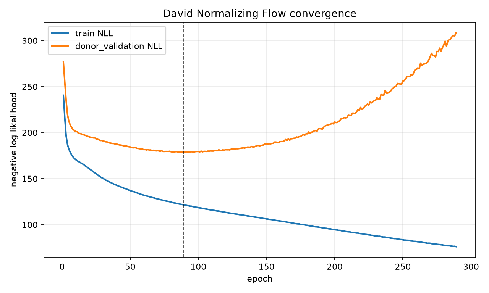
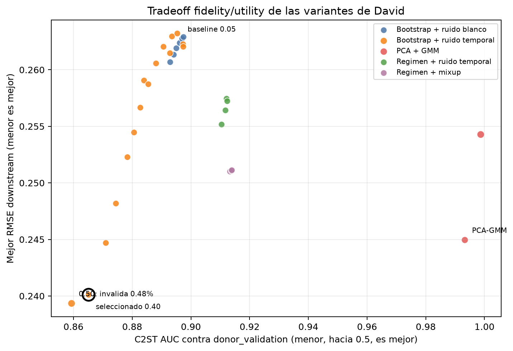
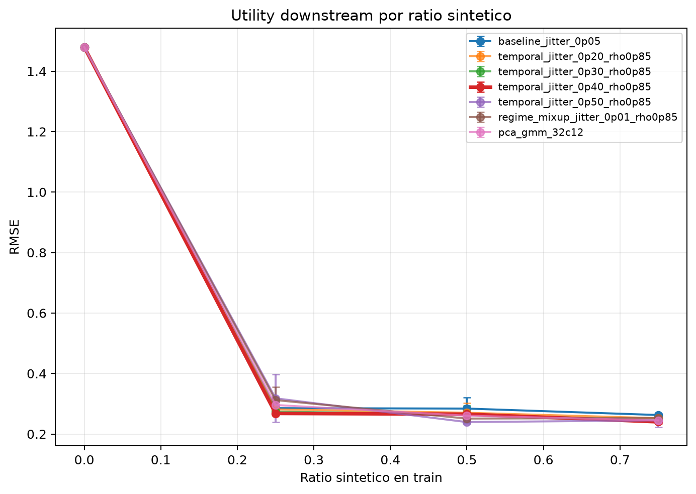
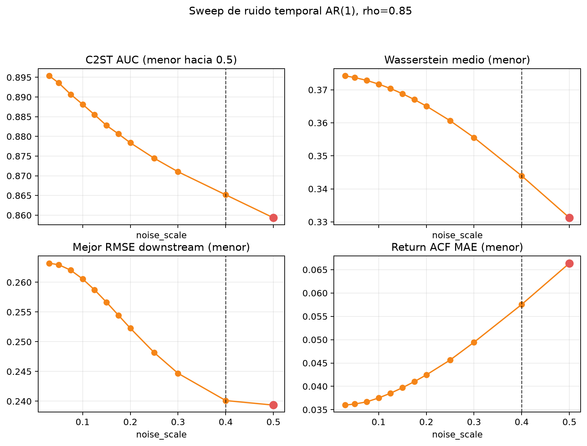
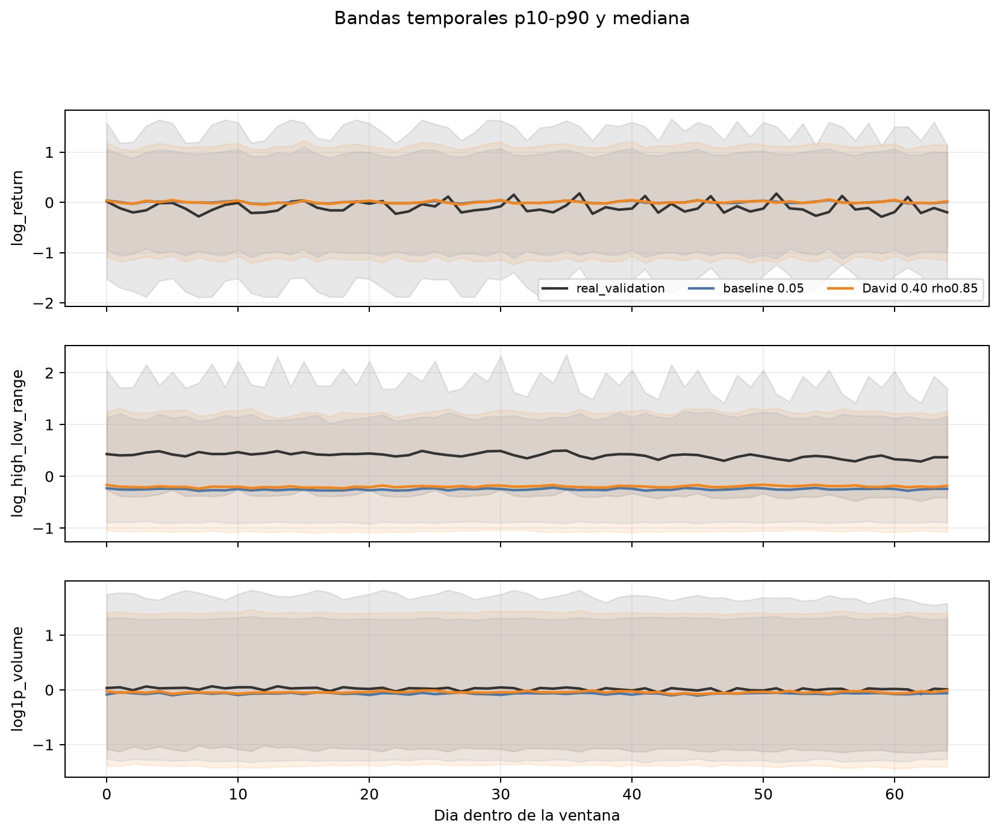

# Generador D - Normalizing Flow (David)

Generador oficial de David para el taller B5-T1. El objetivo es producir
5.000 ventanas sinteticas de semiconductores donors en el espacio comun
`global_channel_normalized`, con la misma forma logica que el resto de
generadores del equipo: `65 x 3` observaciones por ventana y 195 variables
aplanadas por escenario.

La version final usa un Normalizing Flow RealNVP entrenado desde cero sobre
`donor_train`. A diferencia de los primeros experimentos basados en bootstrap
y jitter, el modelo final aprende una transformacion invertible entre ventanas
normalizadas y un prior normal estandar. Esto permite entrenar con likelihood
exacta, calcular el log-det-Jacobian de cada transformacion y muestrear nuevas
ventanas desde la distribucion latente.

## Arquitectura

El modelo esta implementado en NumPy puro en `src/normalizing_flow.py`, sin
depender de PyTorch ni TensorFlow. La arquitectura final es:

| Componente | Valor |
|---|---:|
| Modelo | RealNVP |
| Dimension de entrada | 195 |
| Capas de acoplamiento | 8 |
| Red interna por coupling | MLP tanh `195 -> 96 -> 96 -> 390` |
| ActNorm | si, aprendible por dimension |
| Permutaciones | fijas, entre bloques |
| Prior | normal estandar |
| Parametros entrenables | 530.784 |
| Objetivo | negative log-likelihood |

Cada bloque aplica ActNorm, una transformacion de acoplamiento afin y, salvo
en el ultimo paso, una permutacion fija de dimensiones. La mascara alterna las
variables condicionantes y transformadas, de forma que todas las posiciones de
la ventana terminan pudiendo afectar al resto tras varias capas.



## Datos y contrato

| Split | Ventanas | Uso |
|---|---:|---|
| `donor_train` | 4.910 | ajuste del normalizador y entrenamiento |
| `donor_validation` | 380 | seleccion de checkpoint y fidelidad comun |
| `nvda_visible` | 62 | calibracion en fase de utilidad comun |
| `nvda_test` | 150 | hold-out real para downstream |

El normalizador es el z-score global por canal acordado por el common core:
media y desviacion se ajustan solo con `donor_train` en `float64`, usando los
ejes de ventana y tiempo. Los canales congelados son:

1. `log_return`
2. `log_high_low_range`
3. `log1p_volume`

NVDA no se usa para entrenar el flow, escoger hiperparametros, seleccionar el
checkpoint ni generar muestras normalizadas. La salida oficial queda en
`outputs/bootstrap_jitter_seed42_normalized.parquet`; el nombre se conserva por
compatibilidad con el pipeline, pero `source_model`, la provenance y el
registro comun identifican el metodo real como `normalizing_flow`.

## Entrenamiento

Configuracion oficial de `train_normalizing_flow.py`:

| Hiperparametro | Valor |
|---|---:|
| Seed | 42 |
| Batch size | 256 |
| Learning rate | 5e-4 |
| Weight decay | 5e-5 |
| Grad norm limit | 25 |
| Epocas maximas | 10.000 |
| Early stopping | paciencia 200 |
| Metrica de seleccion | NLL en `donor_validation` |

Resultado del entrenamiento oficial:

| Metrica | Valor |
|---|---:|
| Epocas ejecutadas | 289 |
| Mejor epoca | 89 |
| Mejor `donor_validation` NLL | 178.8691 |
| `donor_train` NLL del checkpoint final | 121.6446 |
| Motivo de parada | early stopping |

La curva muestra el patron esperado en un flow de alta dimension con pocos
datos: el NLL de entrenamiento sigue bajando despues de la epoca 89, pero el
NLL de validacion empeora. Por eso el checkpoint final no es la ultima epoca,
sino el estado con menor NLL en `donor_validation`.

## Generacion oficial

`generate_normalized.py` carga el checkpoint `normalizing_flow_seed42.npz`,
muestrea `z ~ N(0, I)` con temperatura 1.0, aplica la inversa del flow y
exporta 5.000 ventanas en el esquema comun.

| Elemento | Valor |
|---|---|
| Output | `outputs/bootstrap_jitter_seed42_normalized.parquet` |
| Provenance | `outputs/bootstrap_jitter_seed42_normalized.provenance.json` |
| Shape logico | `(5000, 65, 3)` |
| `source_model` | `normalizing_flow` |
| Seed de training/sampling | 42 |
| Muestras generadas | 5.000 |
| Muestras rechazadas | 0 |

El contrato comun de fase 01 certifica la salida de David con `PASS`: 5.000
filas, valores finitos, cero duplicados exactos, `training_seed=42`, canal
ordenado correctamente y normalizacion `NORMALIZATION_NUMERICALLY_MATCHES`.
Ademas, David queda registrado como el metodo que satisface el rol oficial
`normalizing_flow`.

## Benchmark de fidelidad comun

La fase 02 compara todos los metodos certificados contra las 380 ventanas de
`donor_validation`, usando el mismo subconjunto de 380 muestras sinteticas por
metodo. No hay calibracion a NVDA, clipping, reparacion ni re-normalizacion.
La tabla siguiente corresponde a la corrida de fidelidad comun disponible en
`common_pipeline/02_fidelity/results`; si se regenera fase 02 con el parquet
David actualmente certificado por fase 01, los valores pueden moverse
ligeramente porque el hash de la salida de David cambio durante la
canonizacion final.

En esta tabla, un C2ST AUC mas cercano a 0.50 es mejor, y valores menores de
Wasserstein/ACF/correlacion indican menor distancia frente a `donor_validation`.

| Metodo | Familia | C2ST AUC | W1 medio | return ACF MAE | abs-return ACF MAE | corr MAE | NN mediana |
|---|---|---:|---:|---:|---:|---:|---:|
| David | Normalizing Flow | 0.866 | 0.360 | 0.0357 | 0.0297 | 0.064 | 9.979 |
| Bootstrap | simple baseline | 0.897 | 0.374 | 0.0358 | 0.0326 | 0.046 | 0.696 |
| Cristian | WGAN-GP | 0.927 | 0.370 | 0.0353 | 0.0310 | 0.054 | 9.507 |
| Daniel | DDPM | 0.907 | 0.463 | 0.0392 | 0.0280 | 0.080 | 10.712 |
| Marco | VAE | 0.999 | 0.617 | 0.0954 | 0.0424 | 0.046 | 6.298 |

Lectura principal:

- David obtiene el mejor C2ST AUC entre los cuatro generadores oficiales, por
  lo que es el menos distinguible por el clasificador logistico comun.
- David tambien obtiene el mejor Wasserstein medio: 0.360 frente a 0.370 de
  WGAN-GP, 0.463 de DDPM y 0.617 de VAE.
- En autocorrelacion de `abs(log_return)`, David queda cerca de Daniel y por
  delante de bootstrap, Cristian y Marco.
- En correlaciones entre canales, David no es el mejor: bootstrap y Marco
  tienen menor error medio, aunque bootstrap esta extremadamente cerca de
  ventanas de entrenamiento (`NN mediana=0.696`), senal de baja novedad.

En marginales, David mantiene medias cercanas a cero y dispersiones razonables
en los tres canales. Donde mas le cuesta es en los extremos de `log_high_low_range`
y `log1p_volume`: captura bien el centro de la distribucion, pero suaviza parte
de los regimenes mas extremos de `donor_validation` 2022.

## Utilidad y comparacion con benchmarks

La tabla comun de fase 03 versionada actualmente contiene Cristian, Daniel y
Marco, pero no incluye todavia la salida oficial `normalizing_flow` de David.
Por tanto, no hay que presentar un RMSE downstream oficial de David como si ya
formara parte de la corrida final comun.

Benchmarks comunes disponibles en la tarea Ridge con 75% de sintetico:

| Metodo comun | Mejor ratio | RMSE medio | MAE medio | Mejora RMSE vs real-only |
|---|---:|---:|---:|---:|
| Daniel DDPM | 0.75 | 0.2446 | 0.1796 | -83.47% |
| Cristian WGAN-GP | 0.75 | 0.2537 | 0.1822 | -82.86% |
| Marco VAE | 0.75 | 0.3509 | 0.2526 | -76.28% |
| Real-only | 0.00 | 1.4796 | 1.1469 | 0.00% |

Antes de cerrar el rol oficial como Normalizing Flow, se hicieron experimentos
locales de utilidad con familias alternativas. Esos resultados no son el
entregable oficial, pero si explican la evolucion metodologica de David:

| Candidato local | Familia | Mejor ratio | RMSE medio | MAE medio | Invalid rate |
|---|---|---:|---:|---:|---:|
| `baseline_jitter_0p05` | bootstrap independiente | 0.75 | 0.2627 | 0.1840 | 0.00% |
| `temporal_jitter_0p30_rho0p85` | bootstrap temporal | 0.75 | 0.2447 | 0.1684 | 0.00% |
| `temporal_jitter_0p40_rho0p85` | bootstrap temporal | 0.75 | 0.2401 | 0.1658 | 0.00% |
| `temporal_jitter_0p50_rho0p85` | bootstrap temporal | 0.50 | 0.2393 | 0.1702 | 0.48% |
| `pca_gmm_32c12` | PCA + GMM | 0.75 | 0.2449 | 0.1740 | 0.20% |

El resultado practico de esta fase exploratoria fue claro: aumentar la
diversidad con ruido temporal mejoraba mucho la utilidad frente al real-only y
competia con los mejores benchmarks comunes. Sin embargo, esas variantes
seguian siendo esencialmente bootstrap+jitter, no un `normalizing_flow`. Por
eso quedan como evidencia historica y no como salida oficial.





## Evolucion de tecnicas

La ruta de trabajo fue iterativa:

1. `baseline_jitter_0p05`: bootstrap completo de ventanas donor con ruido
   gaussiano independiente. Fue un baseline fuerte en utilidad, pero muy
   cercano al set de entrenamiento.
2. Barrido de jitter independiente (`0.02` a `0.15`): aumento gradual de ruido
   para buscar mas novedad sin romper la estructura fisica.
3. Jitter temporal con correlacion AR (`rho=0.65`, `0.85`, `0.95`): el ruido
   deja de ser punto a punto y respeta mas la continuidad temporal. Las
   variantes `rho=0.85` fueron las mas estables.
4. Barrido de intensidad temporal (`0.03` a `0.50`): se encontro el mejor
   intercambio alrededor de `0.30-0.40`; `0.50` daba el menor RMSE, pero ya
   introducia ventanas fisicamente invalidas.
5. Bootstrap por regimen: muestreo condicionado por volatilidad, tendencia y
   volumen. La utilidad seguia siendo buena, pero la fidelidad comun empeoraba.
6. Mixup de vecinos por regimen: interpolacion entre ventanas parecidas antes
   de anadir ruido temporal. Mejoraba algunos rasgos locales, pero no superaba
   el compromiso de `temporal_jitter_0p40_rho0p85`.
7. PCA+GMM: primer intento mas model-based en espacio latente. Tuvo utilidad
   competitiva, pero C2ST casi perfecto (`0.993-0.999`) indicaba muestras muy
   distinguibles de `donor_validation`.
8. RealNVP Normalizing Flow: cambio final hacia un generador neuronal con
   likelihood exacta, muestreo desde prior y rol oficial `normalizing_flow`.





## Limitaciones

- El espacio es de 195 dimensiones y solo hay 4.910 ventanas de entrenamiento;
  la brecha entre NLL de train y validacion aparece pronto. Early stopping es
  imprescindible.
- El C2ST de David mejora al resto de generadores oficiales, pero 0.866 sigue
  lejos de 0.50. El sintetico no es indistinguible de `donor_validation`.
- La correlacion entre canales no es la metrica donde David domina; su ventaja
  aparece mas en marginales globales, Wasserstein y C2ST.
- Los resultados de utilidad local de `temporal_jitter_*` no deben confundirse
  con la salida oficial. Sirven para explicar decisiones, no para certificar el
  Normalizing Flow en fase 03.
- El nombre del parquet oficial contiene `bootstrap_jitter` por compatibilidad
  historica. La identidad cientifica correcta se debe leer desde `source_model`
  y desde la provenance.

## Reproducibilidad

Desde la raiz del repositorio:

```powershell
python generadores/david/scripts/train_normalizing_flow.py
python generadores/david/scripts/generate_normalized.py
python common_pipeline/01_contract/validate_outputs.py
python common_pipeline/02_fidelity/evaluate_fidelity.py
python common_pipeline/02_fidelity/plot_fidelity.py
```

Para regenerar la evidencia historica de candidatos locales:

```powershell
python generadores/david/scripts/experiment_normalized.py
python generadores/david/scripts/plot_experiment_diagnostics.py
```

Artefactos principales:

- `artifacts/checkpoints/normalizing_flow_seed42.npz`
- `artifacts/loss_history.csv`
- `artifacts/training_manifest_seed42.json`
- `artifacts/normalizing_flow_convergence.png`
- `outputs/bootstrap_jitter_seed42_normalized.parquet`
- `outputs/bootstrap_jitter_seed42_normalized.provenance.json`
