# Generador B — VAE (Marco)

TimeVAE (Desai et al., 2022) adaptado al problema de cold-start de NVDA: aprende
de 10 semiconductores donors (2012-2021) y genera ventanas sintéticas calibradas
a la escala de NVDA, para complementar sus 6 meses reales visibles.

## Arquitectura

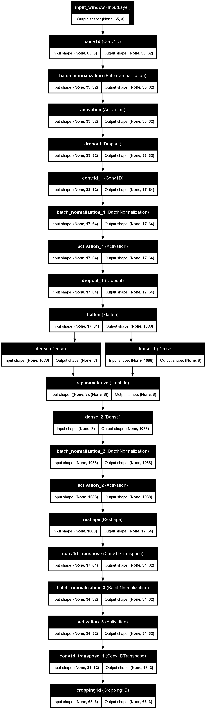

Encoder: 2×(Conv1D → BatchNorm → ReLU → Dropout) → Dense(mu), Dense(logvar).
Decoder: Dense → Reshape → 2×Conv1DTranspose → Cropping1D(0,3) (ajusta 68→65).
`latent_dim=8`. Sin condicionante — a diferencia de un CVAE, aquí no hay
variable exógena externa que mantener aparte de lo generado.

## Datos

| Split | Ventanas | Uso |
|---|---:|---|
| `donor_train` | 4910 | entrenamiento VAE |
| `donor_validation` | 380 | early stopping |
| `nvda_visible` | 62 | NVDA "cold-start" (jul-dic 2022) |
| `nvda_full_history` (Oracle) | 2703 | referencia con historia completa |
| `nvda_test` | 150 | hold-out real, 2023-2025, targets sin solape |

NVDA nunca entra en `donor_train`/`donor_validation`.

## Entrenamiento

Huber loss + KL con free-bits (0.25 nats/dim), warmup de KL en 15 épocas,
Adam lr=1e-3, early stopping (paciencia 10). Mejor época: 10, `val_recon=0.307`.

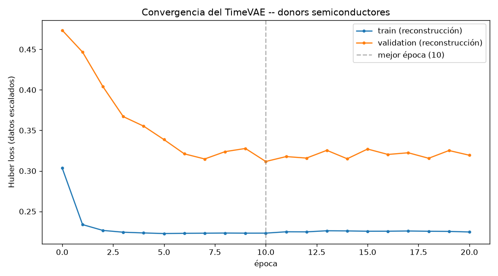

*(Figura correspondiente al reentrenamiento con el scaler corregido — ver
Limitaciones. Si se regenera, usar `python -m generadores.marco.graficar_loss_vae`
con el `loss_history.npz` más reciente.)*

## Generación y calibración

Se genera muestreando `z~N(0,1)` directamente (sin encoder) y decodificando —
5000 ventanas sintéticas por defecto. El resultado se recalibra (media/std) a
los valores reales de `nvda_visible` (126 días únicos reconstruidos, no las
62 ventanas solapadas — ver Limitaciones), para que "patrón de donors + escala
de NVDA".

Sintético exportado en `outputs/nvda_synthetic_windows.parquet` (calibrado a
NVDA) y `outputs/donor_synthetic_normalized_seed42.parquet` (normalizado, sin
calibrar — esquema común de 8 columnas, ver más abajo).

## Experimento: ¿ayuda el sintético con pocos datos reales?

Mismo Ridge entrenado 5 veces (solo real, +25/50/75% sintético, Oracle),
evaluado siempre contra `nvda_test` real. Media de 3 seeds de subsampling
(42, 123, 2026):

| Mezcla | RMSE |
|---|---:|
| 100% real (62 ventanas) | 1.4796 |
| +25% sintético | 0.2656 |
| +50% sintético | 0.2574 |
| +75% sintético | 0.2555 |
| Oracle (2703 reales) | 0.2248 |

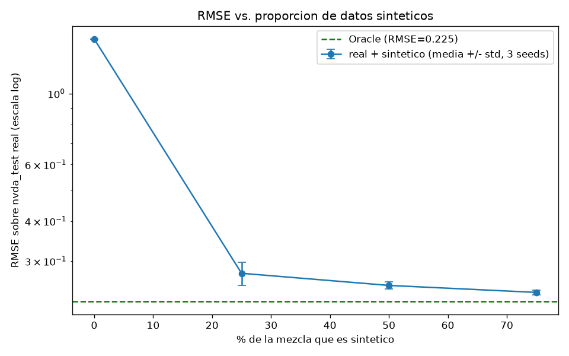

Con solo 62 ventanas reales el modelo generaliza muy mal (RMSE 1.48). Añadir
sintético lo corrige de forma drástica y monótona, acercándose al Oracle
según sube el ratio. Confirmado también a nivel de coeficientes: la
similitud coseno de los pesos del Ridge frente al Oracle pasa de **0.26**
(solo real) a **0.51** (50% sintético) — el sintético no solo baja el error,
empuja a aprender la relación correcta.

## Métricas de calidad

Tres comparaciones, en dos espacios distintos — separando "¿aprendió bien el
VAE la distribución de entrenamiento?" (contra donors, sin calibrar) de
"¿sirve para el problema real?" (contra NVDA, calibrado):

### 1) Sintético calibrado vs. NVDA real (`nvda_visible`)

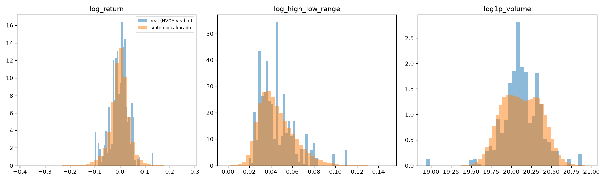
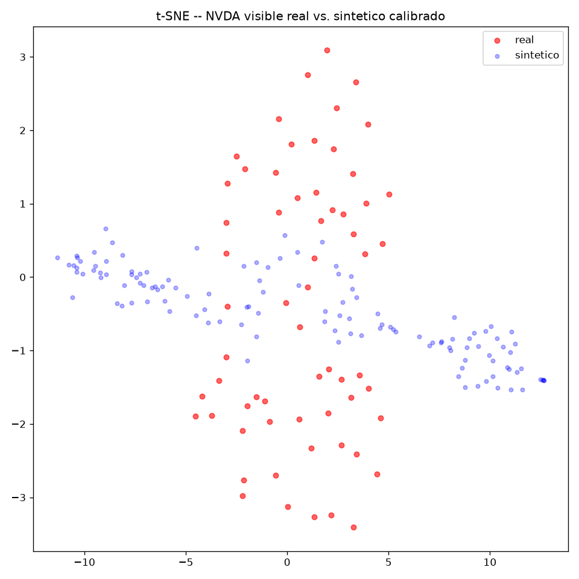
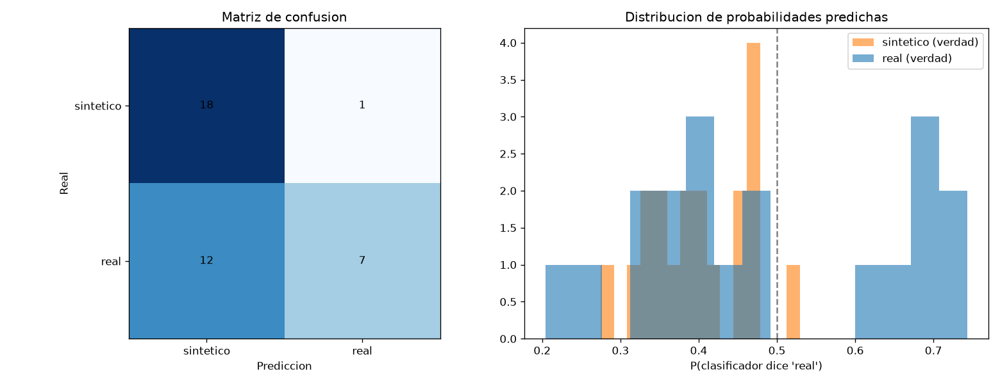

Marginales solapan razonablemente en las 3 variables. t-SNE con solapamiento
parcial (no total, a diferencia del paper original) — dos regiones sintéticas
sin contrapartida real, probablemente porque los donors cubren 10 años de
regímenes de mercado y NVDA visible es un único semestre.

### 2) Sintético (sin calibrar) vs. `donor_validation`

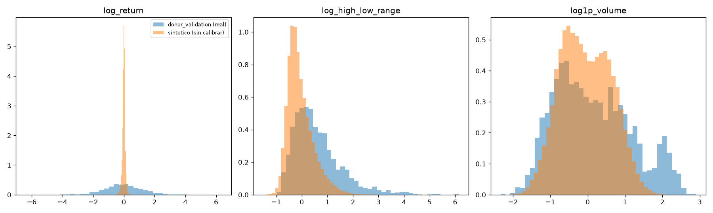
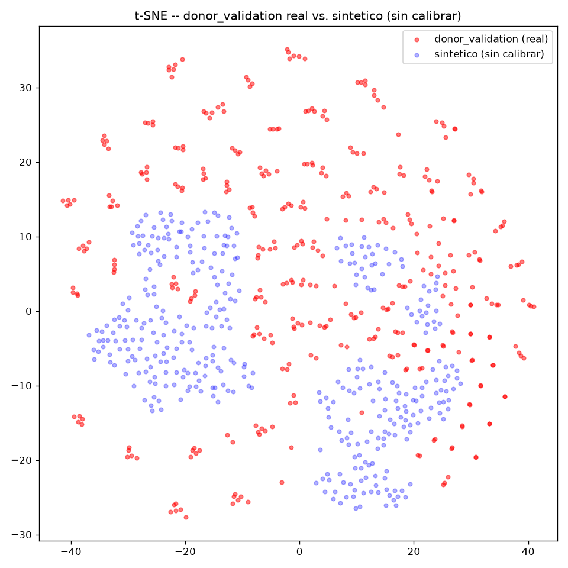
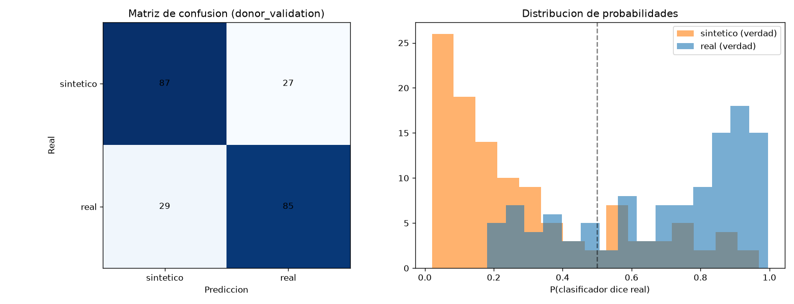

### 3) Sintético (sin calibrar) vs. `donor_train`

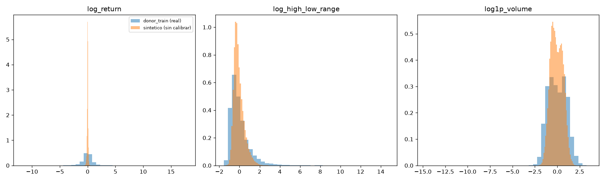
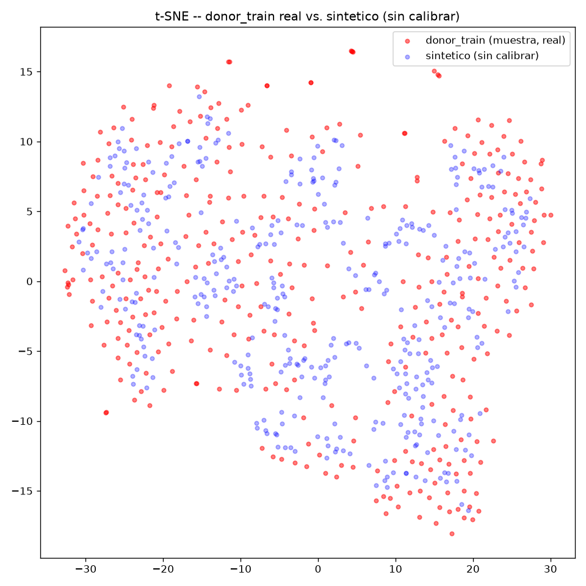
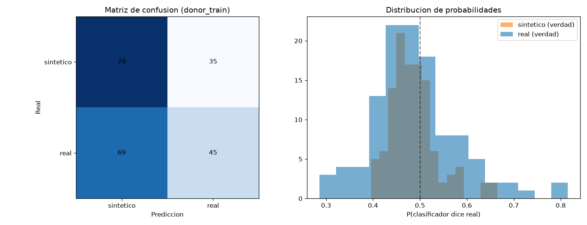

### Comparación de discriminative score entre las tres referencias

| Referencia | Discriminative score |
|---|---:|
| `donor_train` | 0.044 |
| `donor_validation` | 0.254 |
| `nvda_visible` (calibrado) | 0.079 |

El sintético se parece mucho a lo que entrenó (`donor_train`) y algo menos a
`donor_validation` — coherente con que 2022 (validation) ya es en sí mismo un
año atípico (2º más volátil de la década, ligado a las subidas de tipos de la
Fed), no un fallo del generador. La matriz de confusión contra NVDA muestra
que el clasificador confunde sobre todo lo *real* con sintético, no al revés.

### Autocorrelación temporal

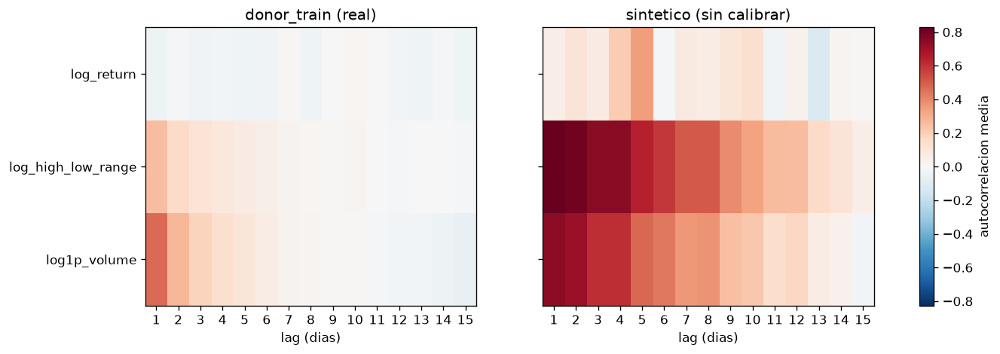

`log_return` retiene solo ~0.9% de su varianza al generar (`log_high_low_range`:
~26%; `log1p_volume`: ~45%). Causa: el decoder produce las 65 ventanas a
partir de un único vector latente compartido, mediante convoluciones que
generan salidas suaves y correlacionadas en el tiempo. Esto reproduce (e
incluso **exagera**) canales con memoria real día a día (`log_high_low_range`,
autocorrelación real 0.26 → el sintético la sostiene más lags de los reales;
`log1p_volume`, 0.47 → mismo patrón), pero no puede replicar ruido
genuinamente independiente como `log_return` (autocorrelación real ≈ -0.04,
consistente con eficiencia de mercado) — ahí, en vez de sobre-suavizar, se
repliega hacia la media y colapsa la varianza.

## Comparabilidad entre generadores (VAE/GAN/Diffusion)

`outputs/donor_synthetic_normalized_seed42.parquet` — 5000 ventanas sintéticas,
espacio normalizado (z-score `donor_train`, **sin calibrar a NVDA**), seed=42.
Esquema común de 8 columnas (`synthetic_id`, `source_model`, `training_seed`,
`space`, `window_length`, `n_channels`, `channel_order`, `features_flat`),
validado por `common_pipeline/01_contract/validate_outputs.py` — `contract_status=PASS`.

Protocolo de comparación en dos niveles, para separar "¿funciona la
arquitectura?" de "¿sirve para el problema real?":

1. **Generación pura**: cada generador compara su `*_normalized_seed42.parquet`
   contra `donor_train`/`donor_validation` (marginales, t-SNE, discriminative
   score) — mismo protocolo que arriba.
2. **Tarea final**: cada generador calibrado a NVDA, mismo experimento de
   mezclas contra `nvda_test` real — resultados agregados de los 3 generadores
   disponibles al momento en `common_pipeline/03_utility/README.md`.

## Limitaciones

- **Colapso de varianza no uniforme por canal**: `log_return` retiene solo
  ~1% de la varianza de entrenamiento al generar (vs 26-45% en las otras
  2 variables) — justo la variable más importante para el downstream.
  Limitación conocida de los VAE al generar desde el prior, no del
  entrenamiento en sí (con `z` real, la reconstrucción es buena).
- La brecha train/validation en el entrenamiento no es sobreajuste: 2022
  es el 2º año más volátil de la década en los donors (ligado a las subidas
  de tipos de la Fed, -36% del índice SOX), y 2020 (dentro de train)
  también reconstruye peor — mismo patrón, año atípico, no memorización.
- Un bug de `free_bits` en la implementación Keras (el suelo se aplicaba al
  KL total en vez de por dimensión) fue detectado y corregido; impacto
  menor en el resultado final.
- Un bug en la base de datos común (`nvda_visible` incluía ventanas cuyo
  contexto se apoyaba en historia oculta) fue detectado, reportado, y
  corregido por el equipo antes del experimento final.
- **Precisión del scaler**: se detectó (auditoría del equipo) que `donor_train`
  se convertía a `float32` antes de calcular media/desviación, en vez de
  después — error relativo de ~3-6e-5 en las estadísticas del scaler. Aunque
  4-5 órdenes de magnitud menor que el colapso de varianza ya documentado,
  se corrigió (`float64` estricto en el ajuste) y se reentrenó el modelo por
  exactitud y comparabilidad con el resto de generadores del equipo.
- **Bug de reproducibilidad en el experimento de mezclas**: una primera
  versión reutilizaba el mismo generador aleatorio (`rng`) entre ratios
  dentro de la misma seed, haciendo que el muestreo de `mix_50`/`mix_75`
  dependiera silenciosamente de haber ejecutado antes `mix_25`. Corregido
  (rng nuevo por cada combinación ratio×seed) tras detectar una discrepancia
  entre dos scripts que debían dar el mismo resultado y no coincidían.

## Trabajo futuro

- Embedding de ticker o condicionante de régimen, para que el generador no
  tenga que "adivinar" en qué tipo de año está la ventana.
- Repetir el experimento de mezclas con más seeds para intervalos de
  confianza más ajustados.

## Reproducibilidad

```powershell
python -m generadores.marco.cargar_datos_compartidos
python -m generadores.marco.entrenar_vae
python -m generadores.marco.generar_sintetico
python -m generadores.marco.reexportar_schema_comun
python -m generadores.marco.experimento_mezclas
```

Seeds: 42, 123, 2026 (experimento de mezclas, un `rng` nuevo por cada
combinación ratio×seed). `scaler_donors.npz` y los `.npz` de caché son
regenerables, no están versionados (ver `.gitignore`).